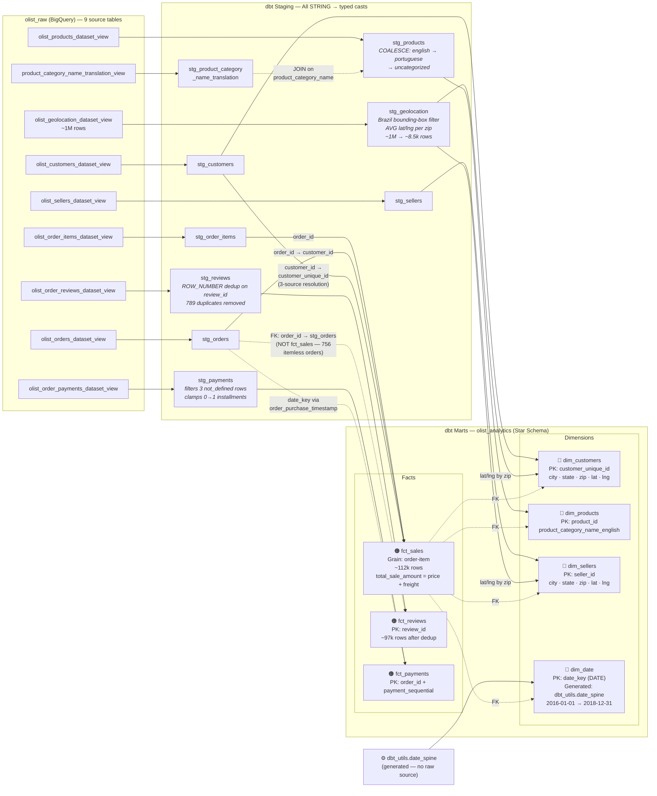

# Data Lineage — Project Caravela

## Key Lineage Notes

1. **`fct_sales` is a 3-source model**: `stg_order_items.order_id` → `stg_orders.customer_id` → `stg_customers.customer_unique_id`. Direct join of `stg_order_items` to `stg_customers` produces zero matches.

2. **`fct_reviews.order_id` → `stg_orders`**, not `fct_sales`: 756 orders have reviews but no items (no `fct_sales` rows). See ADR-003.

3. **`fct_payments` depends on `stg_orders`** for `date_key` (derived from `order_purchase_timestamp`), not from `stg_payments`.

4. **`stg_geolocation`** reduces ~1M raw rows to ~8.5k zip-level aggregates via Brazil bounding-box filter + AVG(lat, lng).

5. **`stg_reviews`** deduplicates on `review_id` (789 duplicates) using `ROW_NUMBER() OVER (PARTITION BY review_id ORDER BY review_answer_timestamp DESC)`.

6. **`dim_date`** is generated by `dbt_utils.date_spine` — it has no raw data source.

7. **`stg_products`** is the only dual-source staging model, joining `olist_products_dataset_view` with `product_category_name_translation_view`.
