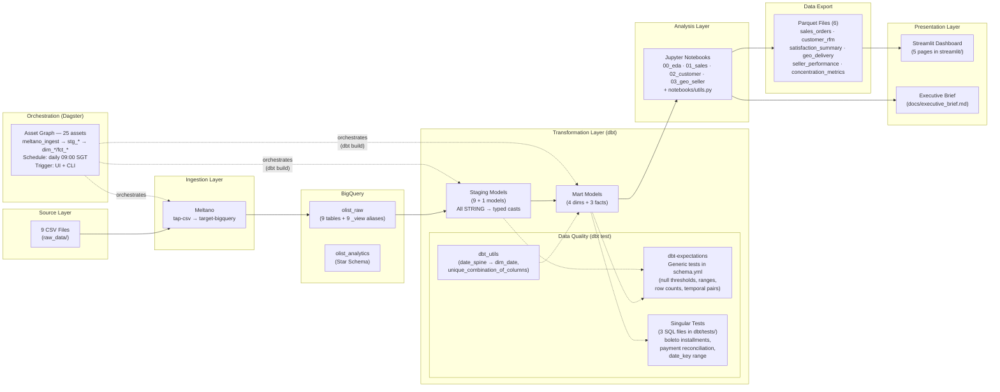

# Pipeline Architecture — Project Caravela

```mermaid
graph LR
    subgraph Sources["Source Layer"]
        CSV["9 CSV Files<br/>(raw_data/)"]
    end

    subgraph Ingestion["Ingestion Layer"]
        MEL["Meltano<br/>tap-csv → target-bigquery"]
    end

    subgraph Storage["BigQuery"]
        RAW["olist_raw<br/>(9 tables + 9 _view aliases)"]
        ANALYTICS["olist_analytics<br/>(Star Schema)"]
    end

    subgraph Transformation["Transformation Layer (dbt)"]
        STG["Staging Models<br/>(9 + 1 models)<br/>All STRING → typed casts"]
        MARTS["Mart Models<br/>(4 dims + 3 facts)"]
        subgraph Quality["Data Quality (dbt test)"]
            GEN["dbt-expectations<br/>Generic tests in schema.yml<br/>(null thresholds, ranges,<br/>row counts, temporal pairs)"]
            SNG["Singular Tests<br/>(3 SQL files in dbt/tests/)<br/>boleto installments,<br/>payment reconciliation,<br/>date_key range"]
            UTIL["dbt_utils<br/>(date_spine → dim_date,<br/>unique_combination_of_columns)"]
        end
    end

    subgraph Orchestration["Orchestration (Dagster)"]
        DAG["Asset Graph — 25 assets<br/>meltano_ingest → stg_* → dim_*/fct_*<br/>Schedule: daily 09:00 SGT<br/>Trigger: UI + CLI"]
    end

    subgraph Analysis["Analysis Layer"]
        NB["Jupyter Notebooks<br/>00_eda · 01_sales · 02_customer · 03_geo_seller<br/>+ notebooks/utils.py"]
    end

    subgraph Export["Data Export"]
        PQ["Parquet Files (6)<br/>sales_orders · customer_rfm<br/>satisfaction_summary · geo_delivery<br/>seller_performance · concentration_metrics"]
    end

    subgraph Presentation["Presentation Layer"]
        ST["Streamlit Dashboard<br/>(5 pages in streamlit/)"]
        EB["Executive Brief<br/>(docs/executive_brief.md)"]
    end

    CSV --> MEL --> RAW
    RAW --> STG --> MARTS
    MARTS -.-> GEN
    STG -.-> GEN
    MARTS -.-> SNG
    UTIL -.-> MARTS
    MARTS --> NB
    NB --> PQ --> ST
    NB --> EB

    DAG -. "orchestrates" .-> MEL
    DAG -. "orchestrates<br/>(dbt build)" .-> STG
    DAG -. "orchestrates<br/>(dbt build)" .-> MARTS
```
