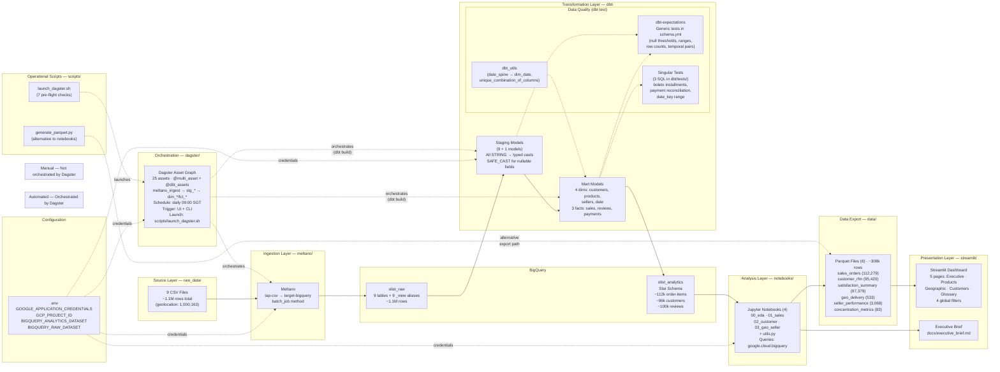

# Pipeline Architecture (Detailed) — Project Caravela

```mermaid
graph LR
    subgraph Config["Configuration"]
        ENV[".env\nGOOGLE_APPLICATION_CREDENTIALS\nGCP_PROJECT_ID\nBIGQUERY_ANALYTICS_DATASET\nBIGQUERY_RAW_DATASET"]
    end

    subgraph Sources["Source Layer — raw_data/"]
        CSV["9 CSV Files\n~1.1M rows total\n(geolocation: 1,000,163)"]
    end

    subgraph Ingestion["Ingestion Layer — meltano/"]
        MEL["Meltano\ntap-csv → target-bigquery\nbatch_job method"]
    end

    subgraph Storage["BigQuery"]
        RAW["olist_raw\n9 tables + 9 _view aliases\n~1.1M rows"]
        ANALYTICS["olist_analytics\nStar Schema\n~112k order-items\n~96k customers\n~100k reviews"]
    end

    subgraph Transformation["Transformation Layer — dbt/"]
        STG["Staging Models\n(9 + 1 models)\nAll STRING → typed casts\nSAFE_CAST for nullable fields"]
        MARTS["Mart Models\n4 dims: customers, products,\nsellers, date\n3 facts: sales, reviews, payments"]
        subgraph Quality["Data Quality (dbt test)"]
            GEN["dbt-expectations\nGeneric tests in schema.yml\n(null thresholds, ranges,\nrow counts, temporal pairs)"]
            SNG["Singular Tests\n(3 SQL in dbt/tests/)\nboleto installments,\npayment reconciliation,\ndate_key range"]
            UTIL["dbt_utils\n(date_spine → dim_date,\nunique_combination_of_columns)"]
        end
    end

    subgraph Automated["Automated — Orchestrated by Dagster"]
        direction LR
    end

    subgraph Orchestration["Orchestration — dagster/"]
        DAG["Dagster Asset Graph\n25 assets · @multi_asset + @dbt_assets\nmeltano_ingest → stg_* → dim_*/fct_*\nSchedule: daily 09:00 SGT\nTrigger: UI + CLI\nLaunch: scripts/launch_dagster.sh"]
    end

    subgraph Manual["Manual — Not orchestrated by Dagster"]
        direction LR
    end

    subgraph Analysis["Analysis Layer — notebooks/"]
        NB["Jupyter Notebooks (4)\n00_eda · 01_sales\n02_customer · 03_geo_seller\n+ utils.py\nQueries: google.cloud.bigquery"]
    end

    subgraph Export["Data Export — data/"]
        PQ["Parquet Files (6) · ~308k rows\nsales_orders (112,279)\ncustomer_rfm (95,420)\nsatisfaction_summary (97,379)\ngeo_delivery (533)\nseller_performance (3,068)\nconcentration_metrics (83)"]
    end

    subgraph Presentation["Presentation Layer — streamlit/"]
        ST["Streamlit Dashboard\n5 pages: Executive · Products\nGeographic · Customers · Glossary\n4 global filters"]
        EB["Executive Brief\ndocs/executive_brief.md"]
    end

    subgraph Scripts["Operational Scripts — scripts/"]
        LS["launch_dagster.sh\n(7 pre-flight checks)"]
        GP["generate_parquet.py\n(alternative to notebooks)"]
    end

    ENV -. "credentials" .-> MEL
    ENV -. "credentials" .-> STG
    ENV -. "credentials" .-> NB
    ENV -. "credentials" .-> DAG

    CSV --> MEL --> RAW
    RAW --> STG --> MARTS
    MARTS -.-> GEN
    STG -.-> GEN
    MARTS -.-> SNG
    UTIL -.-> MARTS
    MARTS --> ANALYTICS

    ANALYTICS --> NB
    NB --> PQ --> ST
    NB --> EB

    DAG -. "orchestrates" .-> MEL
    DAG -. "orchestrates\n(dbt build)" .-> STG
    DAG -. "orchestrates\n(dbt build)" .-> MARTS

    LS -. "launches" .-> DAG
    GP -. "alternative\nexport path" .-> PQ
```
